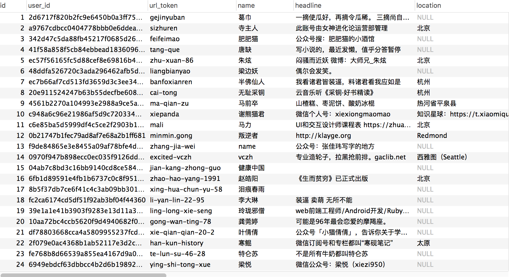
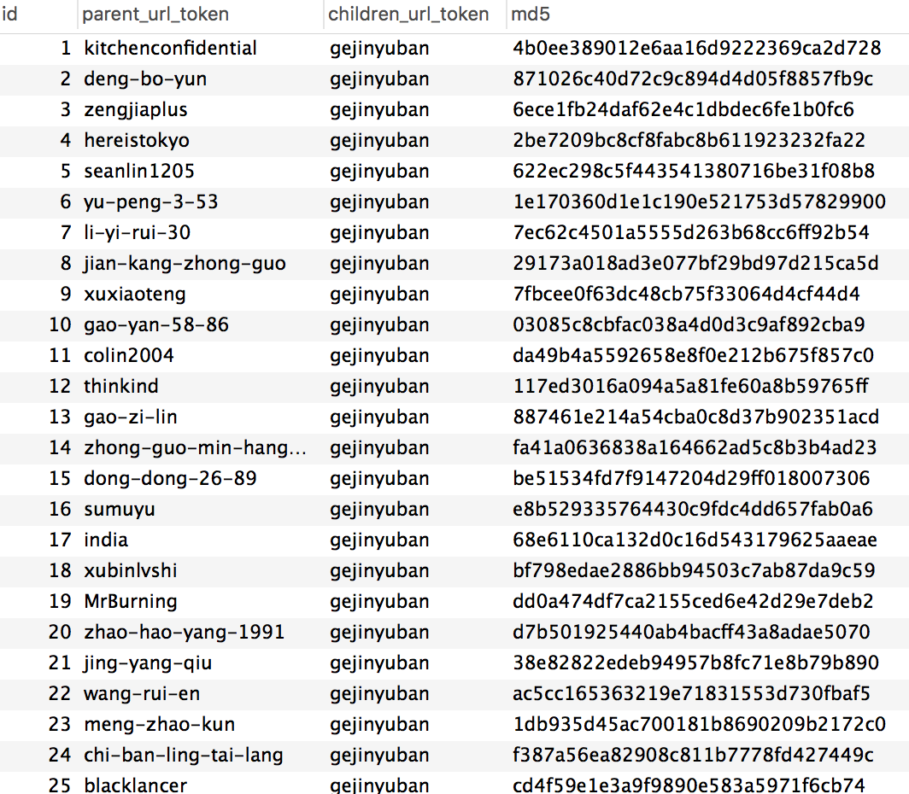

# 知乎用户和关系

### 项目说明
本项目为个人学习使用, 计划使用tornado做数据可视化后端, 采集了一部分知乎用户信息和关注/粉丝关系数据, 采集用户200w及关系4000w后停掉了爬虫

使用scrapy和scrapy-redis, mysql做存储




### 运行流程
- 搭建环境
```
conda create --name=zhihu python=3.5
source activate zhihu
pip install -r requirements.txt
```
- 修改`settings.py`中的`mysql`和`redis`连接
- 如果有代理修改`proxyMiddleware.py`或降低抓取频率
- `python run.py`